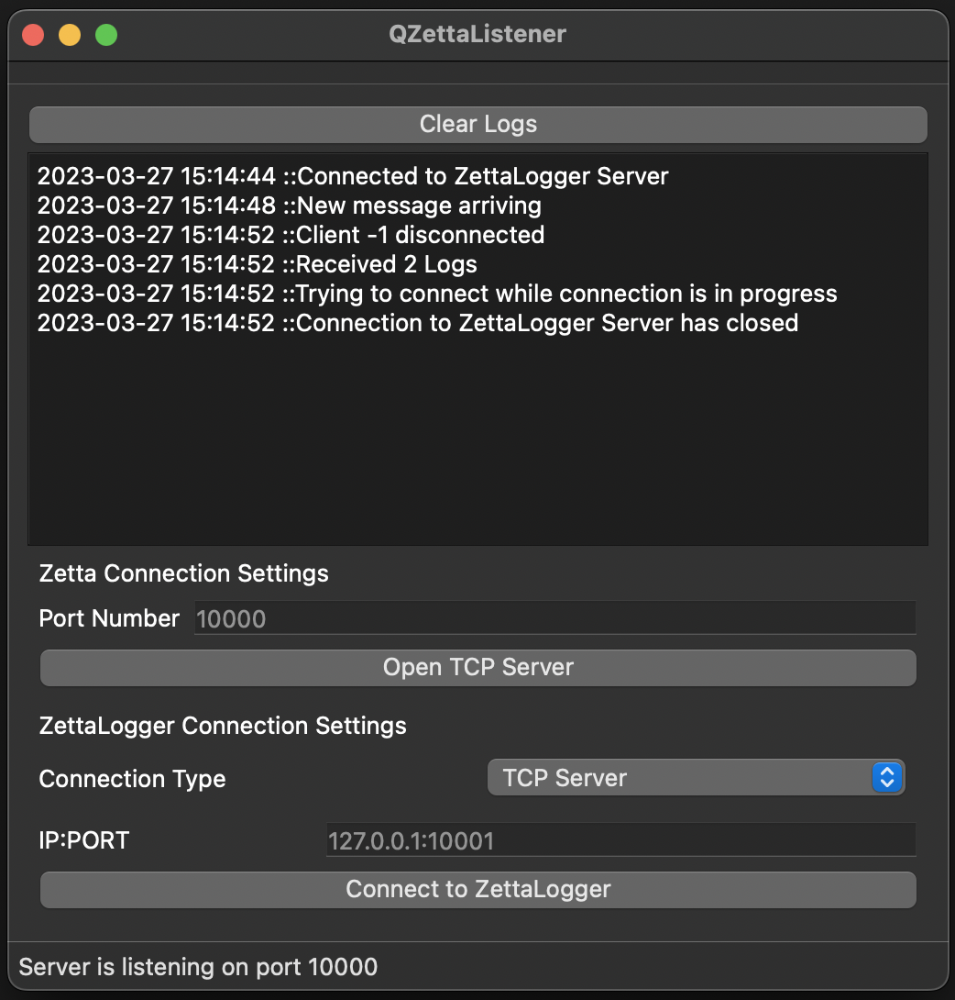

# QZettaListener
* A `Qt` based app for receiving `XML` stream of `LiveMetadata.Send` from `RCS Zetta`.
* Parses `XML` for audio metadata, serializes data for delivery to `QZettaLogger`
* Delivers data to `QZettaLogger` over `TCP` or `Shared Memory`.

## NEXT STEPS
* Serialization of data as `unordered_map<string:string>`
* Use `Boost::Regex` library for `Regular Expression` evaluation.
* Use `Boost::PropertyTree` library for `XML` parsing.
* Use `Boost::asio` for `TCP` i/o and `IPC` i/o and `SIGNAL` handling.
 
